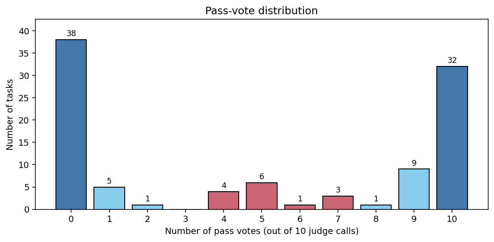
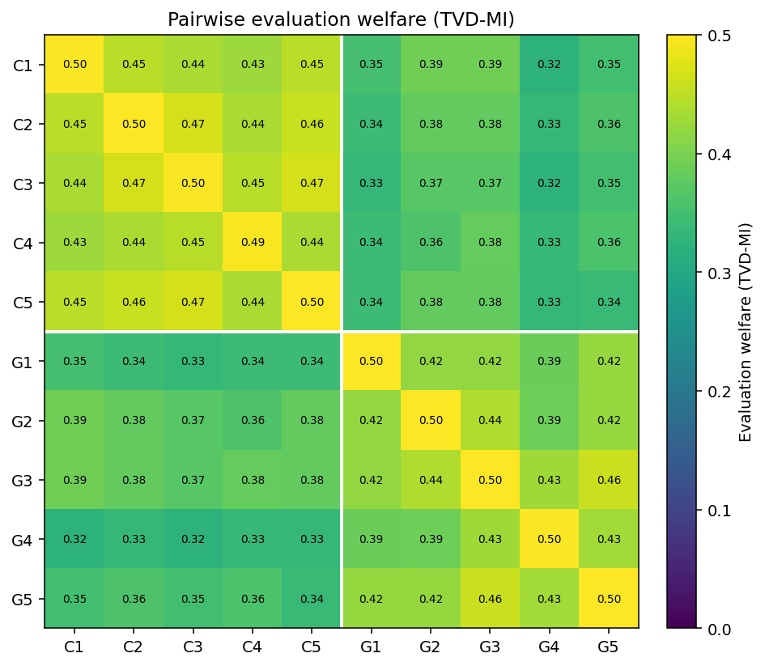
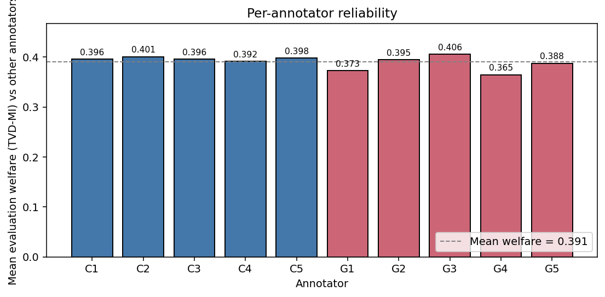

# Self-Evolve Bench Judge Reliability — cocoa-deprivacy-100

**Dataset:** cocoa-deprivacy-100, 100 tasks, 2 judge model(s) (claude-sonnet-4-20250514, gpt-4o), 10 annotator columns total. Inputs held constant per task; only the judge call varies.

## TL;DR

Across the full 10x10 panel of judge calls, same-trace pairs are distinguishable from independently-paired judgements **69.5%** of the time (welfare = 0.391; chance = 50%). Cronbach's a ~ 0.97, mean Cohen's k ~ 0.78. **14 of 100 tasks are contested** (3-7 of 10 calls pass).

## Pass-vote distribution

Of 100 tasks, 70 are unanimous (38 unanimous fail, 32 unanimous pass), and **14 are contested**.

## Reliability summary

| Metric | Value |
|---|---:|
| Evaluation welfare, binary (TVD-MI) | 0.391 |
| Evaluation welfare, finest histogram (84 bins) | 0.931 |
| Distinguishability (1/2 * TVD-MI + 1/2) | 0.695 |
| Mean Cohen's k | 0.782 |
| Cronbach's a (full) | 0.973 |

### Per-block breakdown

| Block | TVD-MI binary | TVD-MI fine | Cohen's k | Cronbach's a |
|---|---:|---:|---:|---:|
| Within claude-sonnet-4-20250514 | 0.447 | 0.944 | 0.899 | 0.978 |
| Within gpt-4o | 0.422 | 0.931 | 0.844 | 0.965 |
| claude-sonnet-4-20250514 <-> gpt-4o | 0.356 | 0.925 | 0.710 | - |

## Figures

## Actionable insights

1. **Adversarial spot-check on the 70 unanimous tasks.**
2. **Triage human review of the 14 contested tasks.**
